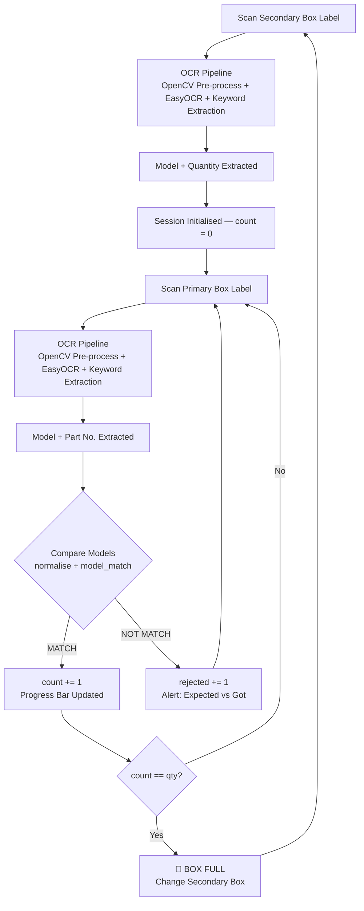

# 📦 Automated Box Packing Verification System (OCR-Based)

A camera/photo-based system that verifies **primary boxes are packed into the correct secondary box** on a packing line — using OpenCV image pre-processing + EasyOCR text extraction to read labels and automatically flag `MATCH` / `NOT MATCH`, no manual comparison required.

---

## ✨ Features

- 📷 Scan a label photo (secondary or primary box) — no dedicated scanner hardware needed
- 🧠 OCR pipeline: OpenCV pre-processing (resize, CLAHE, bilateral filter) → EasyOCR text detection → priority-keyword field extraction
- 🔁 Handles multiple label layouts (`MODEL` field **or** `PRODUCT` / `Part Name` / `Part Number` field) via a fallback keyword chain
- ✅ Real-time model matching with normalised, substring-tolerant comparison
- 📊 Live packed-count vs. secondary box quantity, with progress tracking
- 🚨 Instant alerts on mismatch, and a full-box alert when quantity is reached
- 🌐 Simple browser UI (HTML/CSS/JS) usable from any phone or PC on the local network
- 🧾 Structured JSON output for every scan (model, qty, part no., OCR confidence)

---

## 🛠️ Tech Stack

| Layer | Technology |
|---|---|
| Language | Python 3 |
| OCR Engine | EasyOCR (English model, `mag_ratio=2`) |
| Image Processing | OpenCV (`cv2`), NumPy |
| Text Cleaning | Python `re` (Regex), JSON |
| Backend | FastAPI, Pydantic, Uvicorn (ASGI), CORS Middleware |
| Frontend | HTML5, CSS3, JavaScript (Fetch API) |

---

## 🔄 System Workflow



---

## 📁 Project Structure

```
project/
├── app.py              # FastAPI backend — API routes + session state
├── primary.py           # OCR extraction: Model + Part No. from primary box labels
├── secondary.py          # OCR extraction: Model + Quantity from secondary box labels
├── main.py              # CLI version of the same workflow (terminal fallback)
├── frontend/
│   └── index.html         # Browser UI — upload/preview, auto-fill, progress, alerts
├── requirements.txt
└── README.md
```

---

## 📸 Screenshots

### Scan & Verify Interface

*Step 1 scans the secondary box label (Model + Qty auto-filled). Step 2 scans each primary box and instantly flags a match or mismatch — here catching a model mismatch (`PSDE:875U CON` expected vs. `DIESEL ENGINE-87.5 U` scanned).*

### Live Packing Status

*Real-time dashboard: secondary box number, packed count, capacity, rejected count, progress bar, active secondary model, and scan history log.*

> The image files are included in the `screenshots/` folder of this deliverable — just commit that folder to your repo root alongside the updated `README.md`.

---

## 🔌 API Endpoints

| Method | Endpoint | Purpose |
|---|---|---|
| `POST` | `/api/secondary/upload` | OCR-scan a secondary label; starts a new session (model + qty) |
| `POST` | `/api/secondary/setup` | Manually set secondary model/qty (no image) |
| `POST` | `/api/primary/upload` | OCR-scan a primary label; matches against the session, updates count |
| `POST` | `/api/primary/scan` | Manual primary model entry (no image) |
| `GET` | `/api/session/{station_id}` | Get current session status |
| `POST` | `/api/session/{station_id}/reset` | Clear the session and start fresh |

---

## 🚀 Installation & Run

```bash
git clone https://github.com/akashkum121/Box_Packing_Verifier.git
cd Box_Packing_Verifier
pip install -r requirements.txt
python app.py
```

The server prints a local-network URL (e.g. `http://<your-ip>:8000`) — open it on the same phone/PC used to photograph the labels.

> First run downloads EasyOCR's English model (~100 MB, one-time, needs internet).

---

## 🧭 Usage

1. **Step 1 — Scan Secondary Box Label:** upload/photo the label → Model & Quantity are OCR'd and auto-filled → confirm to start the session.
2. **Step 2 — Scan Primary Box Labels:** upload/photo each box → Model/Part No. are auto-filled and matched instantly.
   - ✅ Match → count increments, progress bar fills.
   - ❌ Mismatch → alert shows expected vs. scanned model; box is not counted.
   - 📦 Reaches quantity → full-screen alert to seal the box and load the next secondary box.

---

## 🧩 How Matching Works

Extracted model strings are normalised (`re.sub(r'[^A-Z0-9]', '', text.upper())`) and considered a match if they're equal **or** one is a substring of the other — tolerating minor formatting differences between how the same model is printed across label templates.

---

## 🔮 Future Scope

- Fuzzy string matching (e.g., Levenshtein distance) for OCR spelling-error tolerance
- Real-time camera-feed scanning instead of manual upload
- Persistent (database-backed) session history for audit/traceability
- Multi-station support via a station-selector UI
- Automated SMS/email/dashboard alerts on repeated mismatches

---

## 📄 Author

Akash Kumar
